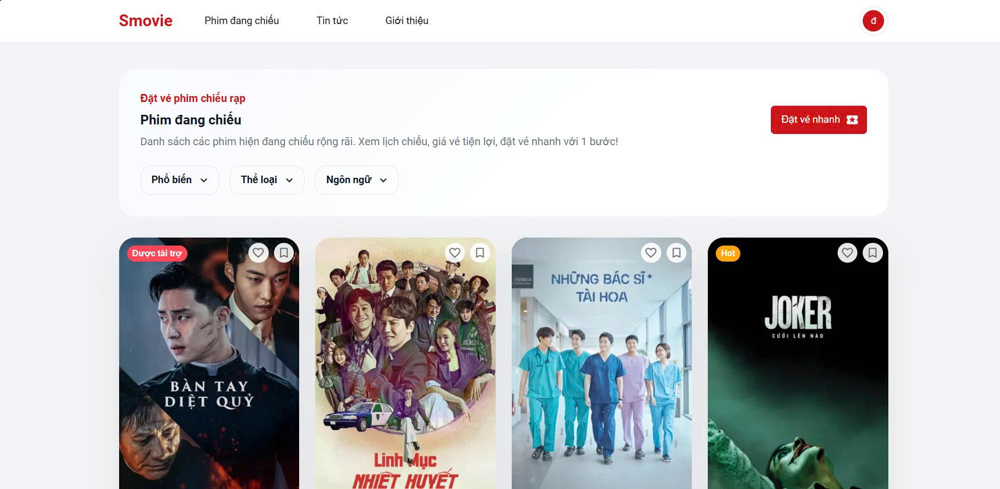
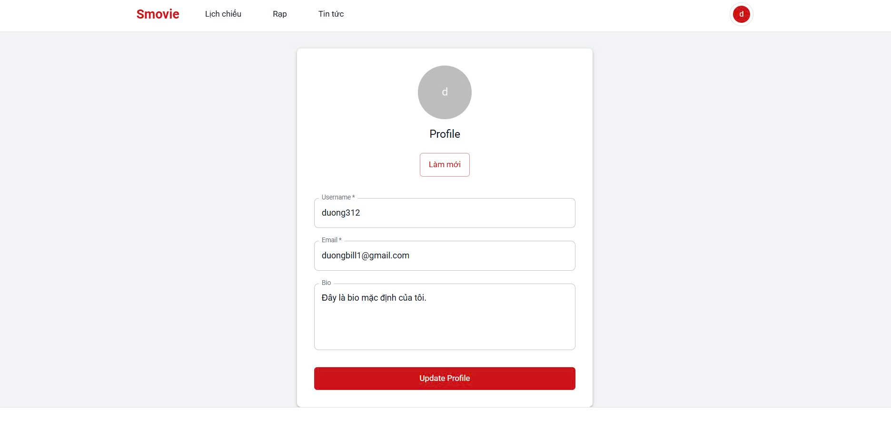
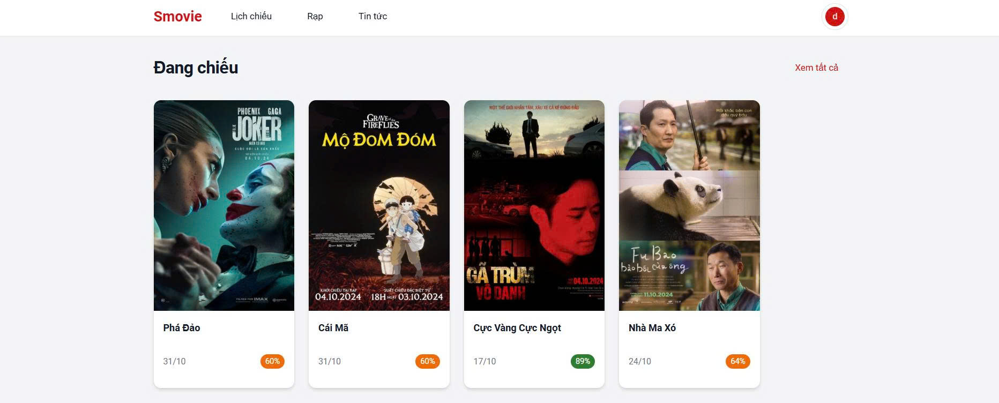
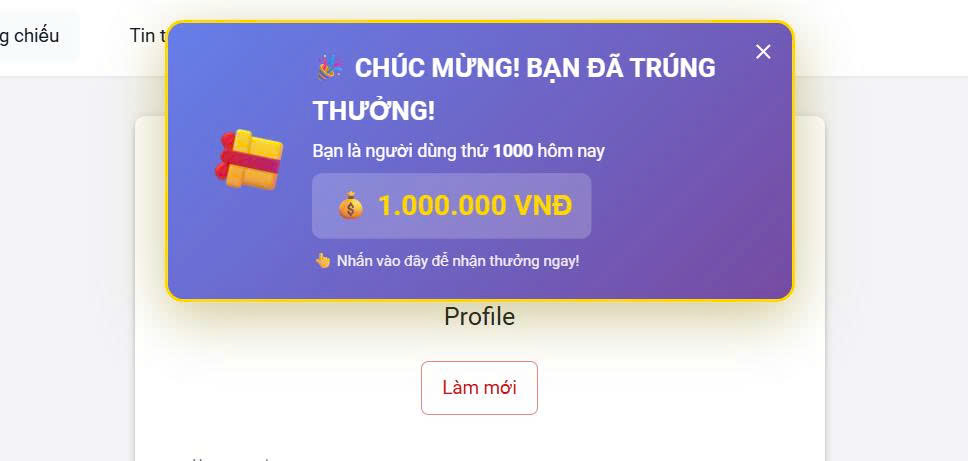

# Đề tài: Mô phỏng tấn công CSRF và cách phòng chống

Họ và tên :
Nguyễn Hải Dương 22810310241
Phạm Ngọc khánh Duy 22810310232
Vũ Hoàng Anh 22810310252

## 1. Giới thiệu

Hệ thống web mô phỏng lỗ hổng CSRF (Cross-Site Request Forgery) và các biện pháp phòng chống hiện đại. Người dùng có thể đăng ký, đăng nhập, xem và đánh giá phim, đồng thời kiểm tra các lớp bảo vệ CSRF.

## 2. Công nghệ sử dụng

- **Backend:** Node.js, Express, MongoDB (Mongoose)
- **Frontend:** React (Vite)
- **Thư viện chính:** express-session, axios, mongoose, @mui/material
- **Database:** MongoDB

## 3. Cấu trúc thư mục dự án

```
csrf-sample-app/
├── client/           # Frontend React
│   ├── src/          # Source code React
│   ├── public/       # Tài nguyên tĩnh
│   └── ...           # Cấu hình, package.json
├── config/           # Cấu hình DB
├── middleware/       # Các middleware bảo vệ
├── models/           # Định nghĩa dữ liệu MongoDB
├── routes/           # API backend
├── tests/            # Test tự động
├── views/            # Giao diện EJS (nếu có)
├── server.js         # Khởi động backend
├── README.md         # Hướng dẫn sử dụng
└── ...               # Các file khác
```

## 4. Hướng dẫn cài đặt & chạy chương trình

### Yêu cầu môi trường

- Node.js >= 18
- MongoDB >= 5

### Lệnh chạy hệ thống

```bash
# Cài đặt backend & frontend
npm install
cd client
npm install

# Chạy backend
npm start

# Chạy frontend (React)
npm run dev
```

### Tài khoản demo

- **User:**
  - Username: `testuser`
  - Password: `123456`

## 5. Kết quả & hình ảnh minh họa

- Hệ thống chống được tấn công CSRF nhờ:

  - Cookie session với SameSite: "Lax"
  - Kiểm tra Anti-CSRF Token cho mọi thao tác POST/PUT/DELETE
  - Chỉ cho phép thay đổi dữ liệu qua các phương thức an toàn

- Ảnh minh họa giao diện:
  
  
  
  


---
