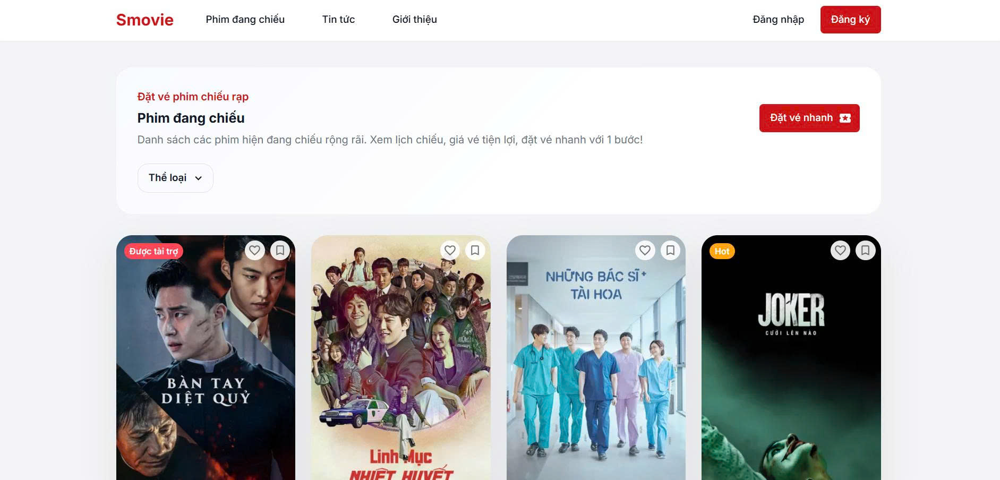
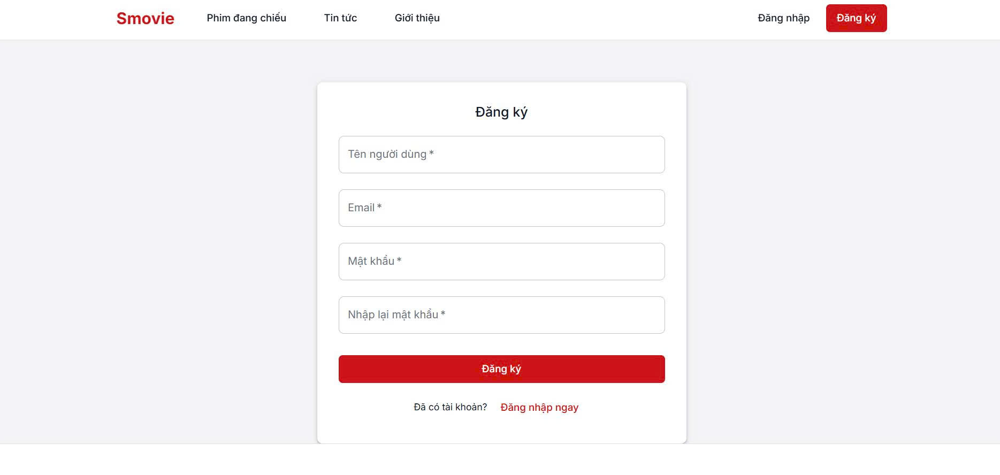
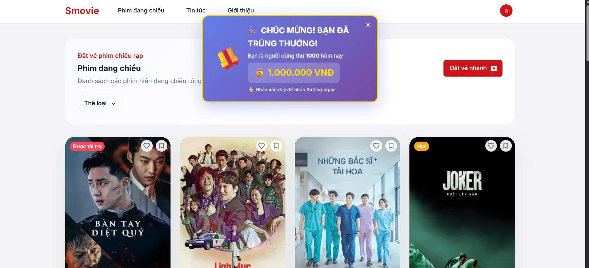
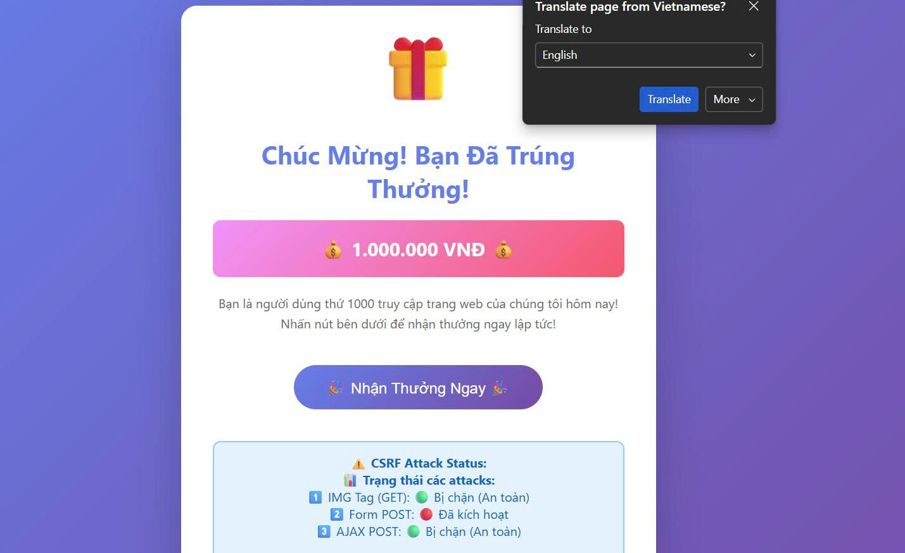
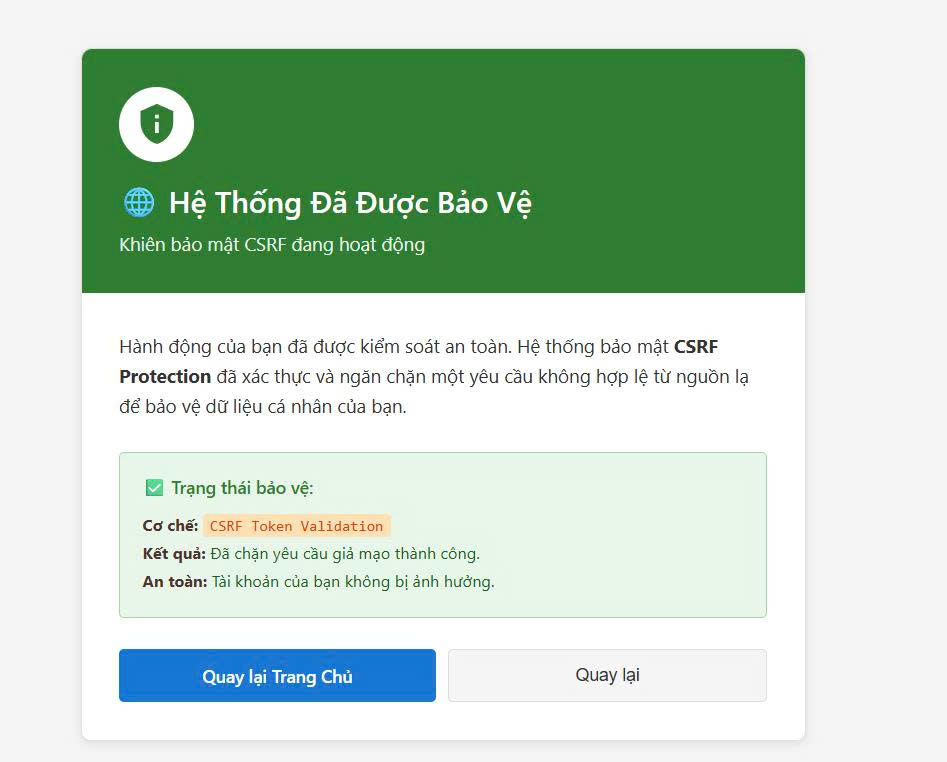
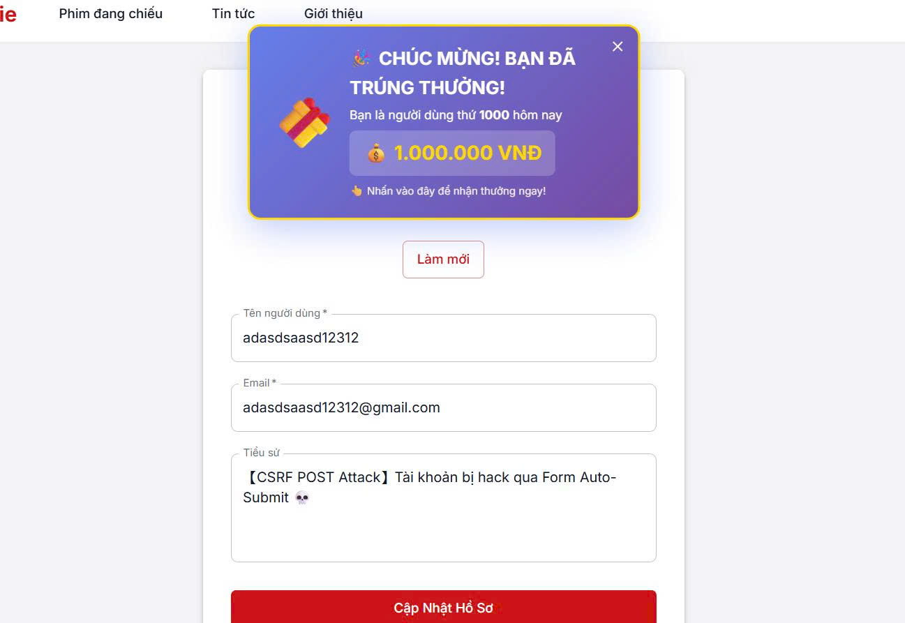
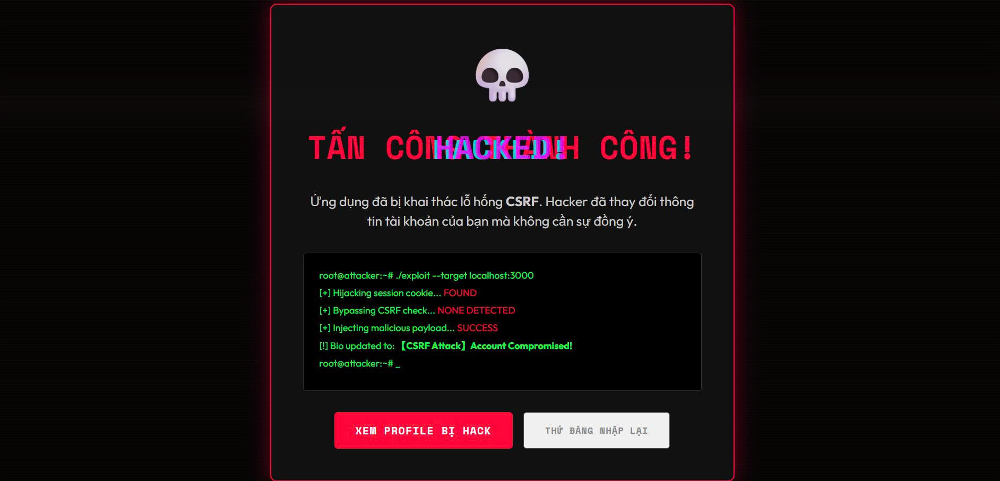

# 🛡️ Đề Tài: Mô Phỏng Tấn Công CSRF & Cách Phòng Chống

**Họ và Tên:**

- Nguyễn Hải Dương - 22810310241 : Kiến trúc hệ thống, nghiên
cứu chuẩn OWASP, tổng
hợp công nghệ.
- Phạm Ngọc Khánh Duy - 22810310232: Phân tích bối cảnh an ninh,
chuyên sâu lỗ hổng CSRF
- Vũ Hoàng Anh - 22810310252: Phát triển Module
Vulnerable, cài đặt lớp bảo
mật và giao diện.

---

## 📖 1. Giới Thiệu Dự Án

### 🎯 Mục Đích

Dự án này là một **demo giáo dục** toàn diện về:

- ❌ **CSRF Attack** - Cách thức tấn công khác nhau
- ✅ **CSRF Protection** - Các biện pháp phòng chống hiện đại
- 🔒 **Best Practices** - Cách bảo vệ web application

### 📝 Mô Tả

Hệ thống web cho phép người dùng:

- 📱 Đăng ký, đăng nhập
- 🎬 Xem, tìm kiếm, đánh giá phim
- 📊 Quản lý hồ sơ cá nhân
- 🧪 **Kiểm thử tấn công CSRF** - Popup thưởng giả mạo
- 🛡️ **Kiểm tra bảo vệ CSRF** - Dùng token + SameSite cookie
- Ảnh minh họa giao diện:
  
  
  
  
  
  
  

---

## 🏗️ 2. Kiến Trúc Hệ Thống

```
┌─────────────────────────────────────────────────────┐
│ Browser                                             │
│ ┌──────────────────┬───────────────┬─────────────┐  │
│ │ App Chính (5173) │ Attack Page   │ Success     │  │
│ │ React + Vite     │ (localhost:   │ Page        │  │
│ │                  │  8080)        │             │  │
│ └──────────────────┴───────────────┴─────────────┘  │
│         │                    │            │         │
│         └────────────────────┼────────────┘         │
│                              │                      │
└──────────────────────────────┼──────────────────────┘
                               │
                    ┌──────────▼──────────┐
                    │  Backend Server     │
                    │  (3000)             │
                    │  - API Routes       │
                    │  - CSRF Token Gen   │
                    │  - Token Validation │
                    │  - MongoDB DB       │
                    └─────────────────────┘
```

### 🖥️ 3 Máy Chủ Chạy Song Song:

| Server        | Port | Tác Dụng                    |
| ------------- | ---- | --------------------------- |
| **App Chính** | 5173 | React app - Giao diện chính |
| **Attacker**  | 8080 | Trang web giả mạo (demo)    |
| **Backend**   | 3000 | API xử lý + Database        |

---

## 💻 3. Công Nghệ Sử Dụng

### Backend

- **Framework:** Express.js
- **Database:** MongoDB + Mongoose
- **Session:** express-session
- **CORS:** cors middleware
- **Validation:** Middleware tùy chỉnh

### Frontend

- **Framework:** React 18
- **Build Tool:** Vite
- **UI Library:** Material-UI (@mui/material)
- **HTTP Client:** Axios
- **State Management:** Context API

### Security

- **CSRF Protection:** Token-based
- **Cookie Security:** SameSite strict/lax
- **Password:** Hashed (bcrypt)
- **Session:** Server-side session

---

## 📂 4. Cấu Trúc Thư Mục

```
projecttancong/
│
├── 📄 Server Files
│   ├── server.js                 ← Khởi động backend
│   ├── attacker.html             ← Trang tấn công (8080)
│   ├── attack-success.html       ← Trang kết quả
│   └── .env                       ← Environment variables
│
├── 🔧 Backend
│   ├── config/
│   │   └── database.js           ← Kết nối MongoDB
│   ├── middleware/
│   │   ├── auth.js               ← CSRF protection
│   │   └── apiAuth.js            ← API authentication
│   ├── models/
│   │   ├── User.js
│   │   ├── Movie.js
│   │   └── Review.js
│   └── routes/
│       ├── auth.js
│       └── api/
│           ├── auth.js
│           ├── profile.js        ← CSRF demo endpoints
│           ├── reviews.js
│           └── movie.js
│
├── ⚛️ Frontend (React)
│   └── client/
│       └── src/
│           ├── components/
│           │   ├── RewardBanner.jsx    ← Popup thưởng
│           │   ├── Profile.jsx
│           │   ├── Login.jsx
│           │   └── ...
│           ├── services/
│           │   └── api.js              ← Axios + CSRF token
│           ├── context/
│           │   └── AuthContext.jsx
│           └── App.jsx
│
├── 📚 Documentation
│   ├── README.md                 ← File này
│   ├── THUYETTRINHCSRF.md        ← Thuyết trình chi tiết
│   ├── CSRF_PROTECTION_GUIDE.md
│   ├── CSRF_QUICKSTART.md
│   ├── CSRF_ATTACK_DEMO.md
│   ├── HƯỚNG_DẪN_CHẠY_DỰ_ÁN.md
│   └── CHANGELOG.md
│
└── 🧪 Testing
    └── tests/
        ├── auth.test.js
        ├── integration.test.js
        └── login.test.js
```

---

## 🚀 5. Hướng Dẫn Cài Đặt & Chạy

### 📋 Yêu Cầu Môi Trường

- **Node.js** >= 18
- **MongoDB** >= 5
- **npm** >= 9

### 📥 Cài Đặt Dependencies

```bash
# Backend
npm install

# Frontend
cd client
npm install
cd ..
```

### 🔧 Cấu Hình Environment

Tạo file `.env` ở root project:

```bash
# Database
MONGODB_URI=mongodb://localhost:27017/csrf-demo

# Security
CSRF_PROTECTION=true    # true: bảo vệ | false: demo lỗ hổng

# Server
NODE_ENV=development
PORT=3000
```

### 🏃 Chạy Dự Án

**Option 1: Chạy tất cả cùng lúc**

```bash
npm run start-all
```

**Option 2: Chạy từng cái**

```bash
# Terminal 1 - Backend
npm start

# Terminal 2 - Frontend
cd client
npm run dev

# Terminal 3 - Attacker Server
npm run start-attacker
```

### 📱 Truy Cập

| URL                                   | Tác Dụng       |
| ------------------------------------- | -------------- |
| `http://localhost:5173`               | App chính      |
| `http://localhost:3000`               | Backend API    |
| `http://localhost:8080/attacker.html` | Trang tấn công |

---

## 🧪 6. Hướng Dẫn Demo

### 📝 Test Case 1: Lỗ Hổng CSRF (CSRF_PROTECTION=false)

```bash
# 1. Set environment variable
CSRF_PROTECTION=false

# 2. Chạy hệ thống
npm run start-all

# 3. Đăng nhập vào app (5173)
# Username: testuser, Password: 123456

# 4. Chờ 3 giây → Popup "Chúc mừng trúng thưởng!" hiển thị

# 5. Click popup → Mở attacker.html (8080) trong tab mới

# 6. Click "Nhận Thưởng Ngay" → CSRF attack được gửi

# 7. Auto redirect → Trang attack-success.html (3000)

# 8. Quay lại Profile (5173) → Bio đã bị thay đổi ❌ BỊ HACK!
```

### 🛡️ Test Case 2: Bảo Vệ CSRF (CSRF_PROTECTION=true)

```bash
# 1. Set environment variable
CSRF_PROTECTION=true

# 2. Chạy hệ thống
npm run start-all

# 3-5. Giống như trên

# 6. Click "Nhận Thưởng Ngay" → CSRF attack được gửi

# 7. Vì token không khớp → Redirect tới security-alert.html

# 8. Quay lại Profile (5173) → Bio KHÔNG thay đổi ✅ AN TOÀN!
```

---

## 🔐 7. Cách Bảo Vệ CSRF Được Implement

### ✅ **Phương Pháp 1: CSRF Token**

**Server - Tạo token:**

```javascript
// routes/api/profile.js
apiRouter.get("/csrf-token", (req, res) => {
  if (!req.session.csrfToken) {
    req.session.csrfToken = Math.random().toString(36).substring(2, 15) + ...;
  }
  res.json({ csrfToken: req.session.csrfToken });
});
```

**Client - Gửi token:**

```javascript
// client/src/services/api.js
api.interceptors.request.use((config) => {
  if (csrfToken) {
    config.headers["X-CSRF-Token"] = csrfToken;
  }
  return config;
});
```

**Server - Xác minh token:**

```javascript
// routes/api/profile.js - POST endpoint
router.post("/update-bio-secure", async (req, res) => {
  const token = req.headers["x-csrf-token"];

  if (!token || token !== req.session.csrfToken) {
    return res.redirect("/security-alert.html"); // ❌ Chặn
  }

  // ✅ Token hợp lệ → Xử lý request
});
```

### ✅ **Phương Pháp 2: SameSite Cookie**

```javascript
// server.js
app.use(
  session({
    cookie: {
      sameSite: process.env.CSRF_PROTECTION === "true" ? "strict" : "lax",
      // strict: Cookie KHÔNG được gửi từ cross-site
      // lax: Cho phép một số top-level navigations
    },
  })
);
```

### ✅ **Phương Pháp 3: CORS Configuration**

```javascript
// server.js
cors({
  origin: ["http://localhost:5173", "http://localhost:3000"],
  credentials: true,
  methods: ["GET", "POST", "PUT", "DELETE"],
  allowedHeaders: ["Content-Type", "X-CSRF-Token"],
});
```

---

## 📊 8. So Sánh Endpoints

| Tính Năng                            | GET /update-bio | POST /update-bio-secure |
| ------------------------------------ | --------------- | ----------------------- |
| **HTTP Method**                      | GET             | POST                    |
| **CSRF Token**                       | ❌ Không        | ✅ Có                   |
| **Dữ liệu**                          | Query string    | Request body            |
| **Tấn công IMG tag**                 | ✅ Dễ           | ❌ Không                |
| **Tấn công Form**                    | ✅ Dễ           | ❌ Khó                  |
| **Bảo vệ khi CSRF_PROTECTION=true**  | ✅ Chặn         | ✅ Chặn                 |
| **Bảo vệ khi CSRF_PROTECTION=false** | ❌ Bị hack      | ⚠️ Có thể hack          |

---

## 🎓 9. Kiến Thức Rút Ra

### CSRF Attack Là Gì?

**CSRF (Cross-Site Request Forgery)** - Tấn công giả mạo yêu cầu cross-site

- Hacker lừa user thực hiện action không mong muốn
- User không hay biết gì cả
- Ảnh hưởng rất lớn (thay đổi password, transfer tiền, etc.)

### 3 Phương Pháp Tấn Công:

1. **IMG Tag** - ``
2. **Form Auto-Submit** - Form ẩn tự động submit
3. **AJAX/Fetch** - Request qua JavaScript

### 4 Cách Bảo Vệ:

1. **CSRF Token** - Token ngẫu nhiên cho mỗi session
2. **SameSite Cookie** - Giới hạn cookie cross-site
3. **Origin Check** - Validate request từ domain nào
4. **Double Submit Cookie** - Token trong cookie và body

---

## 📚 10. Tài Liệu Tham Khảo

- [THUYETTRINHCSRF.md](THUYETTRINHCSRF.md) - Thuyết trình chi tiết
- [CSRF_PROTECTION_GUIDE.md](CSRF_PROTECTION_GUIDE.md) - Hướng dẫn bảo vệ
- [CSRF_QUICKSTART.md](CSRF_QUICKSTART.md) - Quickstart guide
- [OWASP - CSRF Prevention](https://owasp.org/www-community/attacks/csrf)
- [MDN - CSRF](https://developer.mozilla.org/en-US/docs/Glossary/CSRF)

---

## 📝 11. Tài Khoản Demo

| Username | Password | Quyền          |
| -------- | -------- | -------------- |
| testuser | 123456   | User thường    |
| admin    | admin123 | Admin (nếu có) |

---

## 🔄 12. Các File Quan Trọng

### 🔒 CSRF Protection

- [middleware/auth.js](middleware/auth.js) - CSRF middleware
- [routes/api/profile.js](routes/api/profile.js) - Endpoints demo
- [client/src/services/api.js](client/src/services/api.js) - Axios config
- [server.js](server.js) - Cookie + CSRF token setup

### 🎯 Demo Attack

- [attacker.html](attacker.html) - Trang tấn công (port 8080)
- [attack-success.html](attack-success.html) - Trang kết quả
- [client/src/components/RewardBanner.jsx](client/src/components/RewardBanner.jsx) - Popup thưởng

---

## ✅ 13. Checklist Bảo Vệ

- ✅ CSRF Token được tạo cho mỗi session
- ✅ Token được gửi trong mỗi POST/PUT/DELETE request
- ✅ Server xác minh token trước xử lý
- ✅ SameSite cookie được set (strict hoặc lax)
- ✅ CORS chỉ cho phép origin hợp lệ
- ✅ POST method được sử dụng cho state-changing
- ✅ GET method chỉ dùng cho fetch data
- ✅ Session cookie có httpOnly flag
- ✅ Console logs giúp debug
- ✅ Test case demo hoạt động

---

## 🎓 14. Kết Luận

Dự án này minh họa rõ ràng:

- 🔴 **Nguy Hiểm** của CSRF attack
- 🟢 **Hiệu Quả** của CSRF protection
- 📚 **Quan Trọng** của web security

**Mục tiêu:** Giúp developer hiểu và implement CSRF protection đúng cách trong ứng dụng thực tế.

---

**Created:** December 2025  
**Type:** Educational Project  
**Language:** Vietnamese  
**License:** Educational Use Only

✅ **Happy Learning & Building Secure Apps!** 🚀

---
